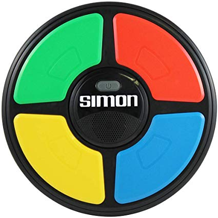
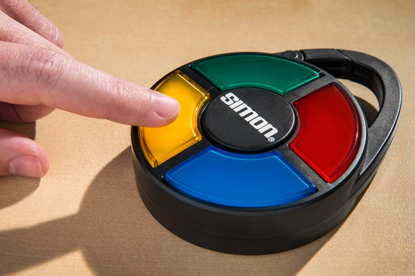
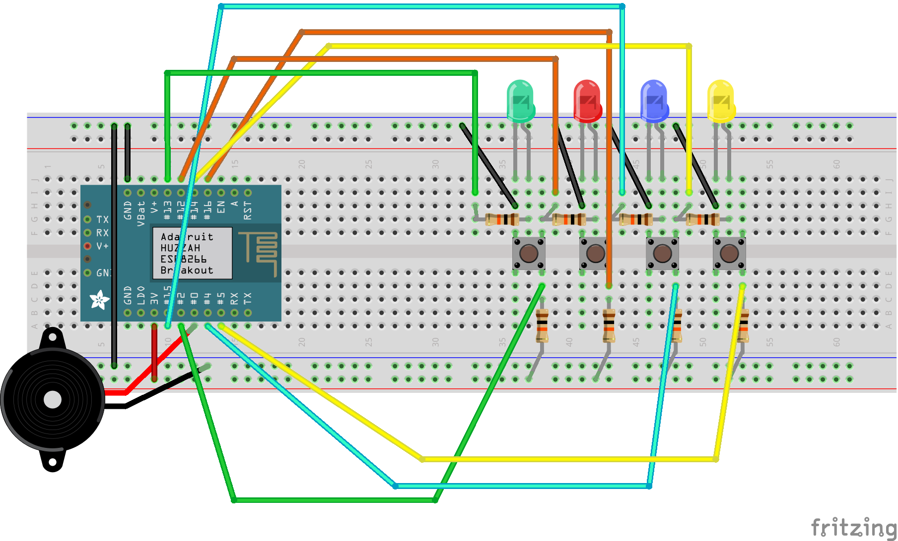

# Mini Simon Game
Created by Myungji

Class : IT-T 892(Smart Technologies) of Illinois Institute of Technology 

## What is Simon Game?

The device has four colored buttons, each producing a particular tone when it is pressed or activated by the device. A round in the game consists of the device lighting up one or more buttons in a random order, after which the player must reproduce that order by pressing the buttons. As the game progresses, the number of buttons to be pressed increases (speed up).

## What did I use?

Adafruit Feather HUZZAH with ESP8266 WiFi

Green LED / Red LED / Blue LED / Yellow LED 

4 Buttons

Piezo Buzzer

10K ohm Resistors

## Diagram

